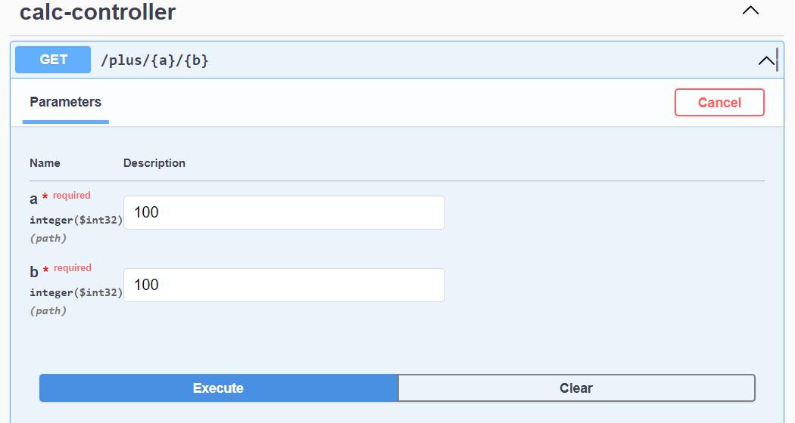
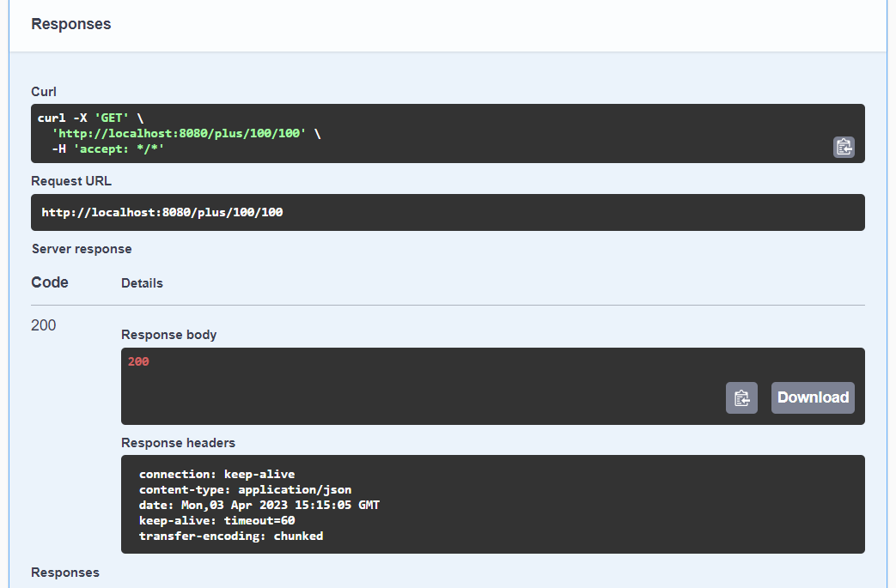
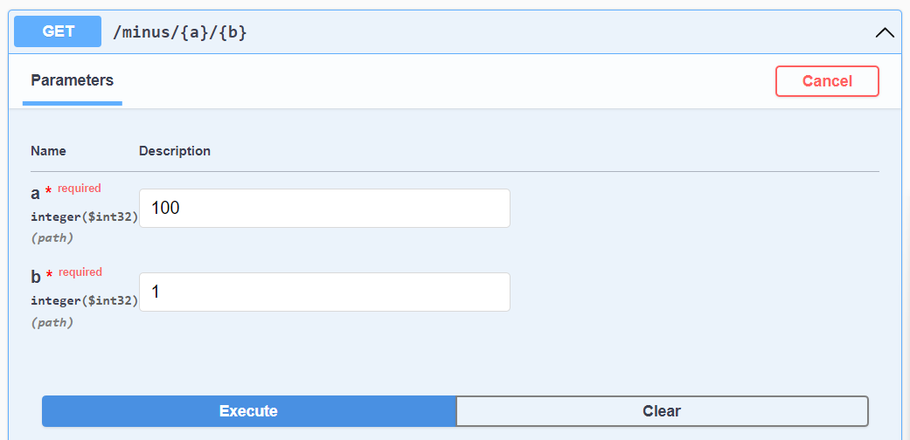

# Rest Api simple calculator written in Java with Spring🌿
Contains two integer methods: `minus()` for subtraction and `plus()` for addition

## Open Api documentation:

### Example of using of `plus()` method:

### Example of using of `minus()` method:

